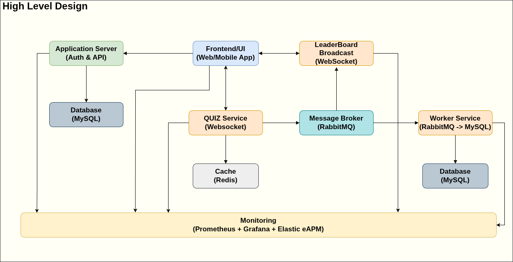

# High Level Design – Component Roles

---

## 1. Application Server (Auth & API)

**Role:**  
Handles user authentication and exposes REST APIs for user management and quiz participation.

**Responsibilities:**
- Authenticates users and issues tokens
- Manages user sessions
- Provides REST endpoints for quiz discovery, joining, and general data retrieval
- Reads/writes persistent data to the main relational database (MySQL)

---

## 2. Database (MySQL)

**Role:**  
Stores persistent data for users, quizzes, scores, and historical records.

**Responsibilities:**
- Holds user credentials, quiz metadata, and results
- Serves as the source of truth for all transactional and historical data
- Is accessed by both the Application Server and Worker Service for reads and writes

---

## 3. Frontend/UI (Web/Mobile App)

**Role:**  
Provides the user interface for quiz participation and leaderboard viewing.

**Responsibilities:**
- Allows users to log in, join quizzes, and submit answers
- Establishes WebSocket connections to the Quiz Service for real-time interactions
- Receives real-time leaderboard updates from the LeaderBoard Broadcast service
- Presents quiz questions and live results

---

## 4. QUIZ Service (WebSocket)

**Role:**  
Manages real-time quiz sessions and user interactions over WebSocket connections.

**Responsibilities:**
- Allow users to join quiz with user's ID.
- Receives and processes user answers in real time
- Updates user scores in the cache (Redis)
- Publishes score and leaderboard update events to the Message Broker (RabbitMQ)

---

## 5. Cache (Redis)

**Role:**  
Provides fast, in-memory storage for frequently updated data such as user scores during live quizzes.

**Responsibilities:**
- Stores and retrieves user scores for quick leaderboard calculations
- Reduces load on the main database by caching hot data
- Ensures real-time responsiveness for quiz and leaderboard updates

---

## 6. Message Broker (RabbitMQ)

**Role:**  
Facilitates decoupled, asynchronous communication between services.

**Responsibilities:**
- Receives events (e.g., score updates) from the QUIZ Service
- Forwards leaderboard update events to the LeaderBoard Broadcast service
- Queues database write tasks for the Worker Service
- Ensures reliable delivery and processing of messages between components

---

## 7. LeaderBoard Broadcast (WebSocket)

**Role:**  
Broadcasts real-time leaderboard updates to all connected clients.

**Responsibilities:**
- Subscribes to leaderboard update events from the Message Broker
- Fetches the latest leaderboard data from the cache
- Pushes real-time updates to the Frontend/UI over WebSocket connections
- Ensures all users see up-to-date rankings instantly

---

## 8. Worker Service (RabbitMQ → MySQL)

**Role:**  
Processes background tasks and writes data to the main database.

**Responsibilities:**
- Listens to the message queue for tasks (e.g., persisting scores)
- Writes quiz results, scores, and other updates to MySQL
- Offloads heavy or non-real-time database operations from the QUIZ Service

---

## 9. Monitoring (Prometheus + Grafana + Elastic eAPM)

**Role:**  
Provides observability, alerting, and performance analytics for the entire system.

**Responsibilities:**
- Collects metrics from all services (e.g., connection counts, response times, error rates)
- Visualizes system health and performance in Grafana dashboards
- Enables alerting on critical events or bottlenecks
- Supports distributed tracing and deep diagnostics with Elastic eAPM

---
